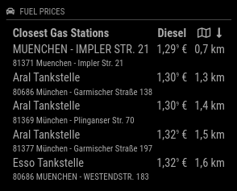
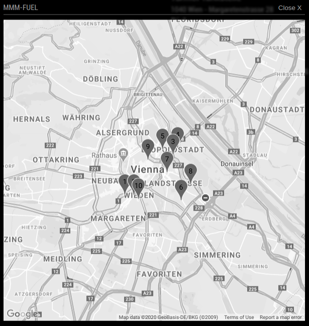
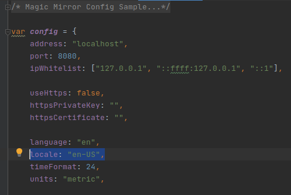

[](https://raw.githubusercontent.com/fewieden/MMM-Fuel/master/LICENSE)  [](https://codeclimate.com/github/fewieden/MMM-Fuel) [](https://snyk.io/test/github/fewieden/mmm-fuel)

# MMM-Fuel

Gas Station Price Module for MagicMirror<sup>2</sup>

## Examples

 

## Dependencies

* An installation of [MagicMirror<sup>2</sup>](https://github.com/MichMich/MagicMirror)
* OPTIONAL: [Voice Control](https://github.com/fewieden/MMM-voice) and [MMM-Modal](https://github.com/fewieden/MMM-Modal)
* npm
* [lodash](https://www.npmjs.com/package/lodash)
* [moment](https://www.npmjs.com/package/moment)
* [node-fetch](https://www.npmjs.com/package/node-fetch)
* [node-html-parser](https://www.npmjs.com/package/node-html-parser)

## Installation

* Clone this repo into `~/MagicMirror/modules` directory.
* Configure your `~/MagicMirror/config/config.js`:

```js
{
    module: "MMM-Fuel",
    position: "top_right",
    config: {
        api_key: "xxxxxxxx-xxxx-xxxx-xxxx-xxxxxxxxxxxx",
        lat: 52.518611,
        lng: 13.408333,
        types: ["diesel"],
        // all your config options, which are different than their default values
    }
}
```

* Run command `npm i --production` in `~/MagicMirror/modules/MMM-Fuel` directory.

## Config Options

| **Option** | **Default** | **Description** |
| --- | --- | --- |
| `provider` | `"tankerkoenig"` | API provider (See full list below). |
| `lat` | REQUIRED | Decimal degrees latitude. |
| `lng` | REQUIRED | Decimal degrees longitude. |
| `types` | `["diesel"]` | Fuel types in an array e.g. `["diesel", "e5"]`. All valid types can be seen in the specific provider section below. |
| `sortBy` | `"diesel"` | Price sorting by which fuel type defined in config option `types`. |
| `open` | `false` | Display whether the gas station is open or not. |
| `radius` | `5` | Lookup Area for Gas Stations in km. |
| `max` | `5` | How many gas stations should be displayed. |
| `map_api_key` | `false` | Required to show the gas stations map with traffic layer. You can get it [here](https://console.developers.google.com/) and don't forget to activate maps api for javascript. |
| `zoom` | `12` | Zoom of the map. (Min 0, Max 18 depends on the area) |
| `height` | `600` | Height of the map in pixel. |
| `width` | `600` | Width of the map in pixel. |
| `colored` | `false` | Boolean to show the gas stations map colored or not. |
| `shortenText` | `false` | Integer of characters to be shown for name and address. Default shows all. |
| `showAddress` | `true` | Boolean to show the gas station's address. |
| `showOpenOnly` | `false` | Boolean to show only open gas stations or all. |
| `showDistance` | `true` | Boolean to show the distance to your specified position. |
| `showBrand` | `false` | Boolean to show the brand instead of the name. |
| `iconHeader` | `true` | Boolean to display the car icon in the header. |
| `rotate` | `true` | Boolean to enable/disable rotation between sort by price and distance. |
| `rotateInterval` | `60000` (1 min) | How fast the sorting should be switched between byPrice and byDistance. |
| `updateInterval` | `900000` (15 mins) | How often should the data be fetched. **If your value is to small, you risk to get banned from the API provider. I suggest a minimum of 15mins** |
| `fade` | `true` | Boolean to fade out the list of gas stations. |

## Global config

| **Option** | **Default** | **Description** |
| --- | --- | --- |
| `locale` | `undefined` | By default it is using your system settings. You can specify the locale in the global MagicMirror config. Possible values are for e.g.: `'en-US'` or `'de-DE'`. |

To set a global config you have to set the value in your config.js file inside the MagicMirror project.



### tankerkoenig (Germany only)

Read the [Terms of Use](https://creativecommons.tankerkoenig.de/#usage) carefully, especially the restrictions for smart mirrors,
or your API access will be suspended.

| **Option** | **Default** | **Description** |
| --- | --- | --- |
| `api_key` | REQUIRED | Get an API key for free access to the data of [tankerkoenig.de](https://creativecommons.tankerkoenig.de/#register). |
| `types` | `["diesel"]` | Valid options are `diesel`, `e5` and `e10`. |
| `radius` | `5` | Valid range is 0-25. Set to 0 to disable. Not required if `stationIds` are provided. |
| `showAddressCity` | `true` | Boolean to show the gas station's city. |
| `stationIds` | `[]` | Optional array of fuel station ids to fetch instead of the radius. You can only specify a maximum of 10 and you can find the ids [here](https://creativecommons.tankerkoenig.de/TankstellenFinder/index.html). Using radius and station ids in parallel will result in more API calls. If you run into issues increase the `updateInterval`. |
| `excludeStationIds` | `[]` | Optional array of fuel station ids to exclude from the radius. This is useful e.g. if you got a non public or truck exclusive station in the radius. You can find the ids [here](https://creativecommons.tankerkoenig.de/TankstellenFinder/index.html).|

### spritpreisrechner (Austria only)

No API key required.

| **Option** | **Default** | **Description** |
| --- | --- | --- |
| `provider` | `"tankerkoenig"` | Make sure you set it to `"spritpreisrechner"`. |
| `types` | `["diesel"]` | Valid options are `diesel`, `e5` and `gas`. |
| `radius` | `5` | Valid range not tested yet. |
| `max` | `5` | The API provider returns maximum of 5 valid datasets. |
| `showAddressCity` | `true` | Boolean to show the gas station's city. |
| `showBrand` | `false` | The API provider does not return brand information. |

### autoblog (USA only)

No API key required. The displayed distance is not based on your coordinates but on the zip code.

| **Option** | **Default** | **Description** |
| --- | --- | --- |
| `provider` | `"tankerkoenig"` | Make sure you set it to `"autoblog"`. |
| `zip` | REQUIRED | The zip code of your address, e.g. `"12345"` |
| `types` | `["diesel"]` | Valid options are `regular`, `mid-grade`, `premium` and `diesel`. |
| `radius` | `5` | Valid range not tested yet. |
| `lat` | `undefined` | Not supported |
| `lng` | `undefined` | Not supported |
| `open` | `false` | Not supported |
| `showOpenOnly` | `false` | Not supported |
| `showBrand` | `false` | Not supported |

### gasbuddy (USA and Canada only)

No API key required. The displayed distance is not based on your coordinates but on the zip code.

| **Option** | **Default** | **Description** |
| --- | --- | --- |
| `provider` | `"tankerkoenig"` | Make sure you set it to `"gasbuddy"`. |
| `zip` | REQUIRED | The zip code of your address, e.g. `"12345"` |
| `types` | `["regular"]` | Valid options are `regular`, `midgrade`, `premium`, `diesel`, `e85`, and `unl88`. |
| `showDistance` | `false` | Not supported |
| `radius` | `5` | Not supported |
| `lat` | `undefined` | Not supported |
| `lng` | `undefined` | Not supported |
| `open` | `false` | Not supported |
| `showOpenOnly` | `false` | Not supported |
| `showBrand` | `false` | Not supported |

### nsw (Australia NSW and TAS only)

This provider gives no information if the gas stations are open or closed.
Config options should be set accordingly `open`: false and `showOpenOnly`: false.

| **Option** | **Default** | **Description** |
| --- | --- | --- |
| `api_key` | REQUIRED | Get an API key for free access to the data of [api.nsw](https://api.nsw.gov.au/). |
| `provider` | `"tankerkoenig"` | Make sure you set it to `"nsw"`. |
| `secret` | REQUIRED | You also need to add the secret visible in your dashboard on [api.nsw](https://api.nsw.gov.au/). |
| `types` | `["diesel"]` | Valid options are `diesel`, `e5`. |
| `radius` | `5` | Valid range not tested yet. |

## OPTIONAL: Voice Control and Modal

This module supports voice control by [MMM-voice](https://github.com/fewieden/MMM-voice) and [MMM-Modal](https://github.com/fewieden/MMM-Modal).
In order to use this feature, it's required to install the voice and modal modules. There are no extra config options for voice control and modals needed.

### Mode

The voice control mode for this module is `FUEL`

### List of all Voice Commands

* OPEN HELP -> Shows the information from the readme here with mode and all commands.
* CLOSE HELP -> Hides the help information.
* SHOW GAS STATIONS MAP -> Shows a map with the gas stations labeled by Price starting with 1.
* HIDE GAS STATIONS MAP -> Hide the map.

## Developer

* `npm run lint` - Lints JS and CSS files.
* `npm run docs` - Generates documentation.

### API Provider Development

If you want to add another API provider checkout the [Guide](apis).
