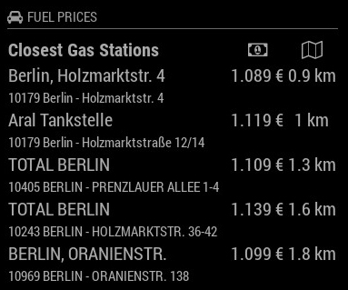
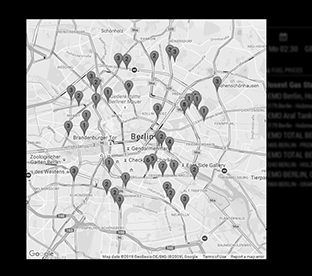

[](https://raw.githubusercontent.com/fewieden/MMM-Fuel/master/LICENSE) [](https://travis-ci.org/fewieden/MMM-Fuel) [](https://codeclimate.com/github/fewieden/MMM-Fuel) [](https://snyk.io/test/github/fewieden/mmm-fuel) [](https://doclets.io/fewieden/MMM-Fuel/master)

# MMM-Fuel

Gas Station Price Module for MagicMirror<sup>2</sup>

## Examples

  

## Dependencies

* An installation of [MagicMirror<sup>2</sup>](https://github.com/MichMich/MagicMirror)
* OPTIONAL: [Voice Control](https://github.com/fewieden/MMM-voice)
* npm
* [request](https://www.npmjs.com/package/request)

## Installation

1. Clone this repo into `~/MagicMirror/modules` directory.
1. Configure your `~/MagicMirror/config/config.js`:

    ```
    {
        module: "MMM-Fuel",
        position: "top_right",
        config: {
            api_key: "xxxxxxxx-xxxx-xxxx-xxxx-xxxxxxxxxxxx",
            lat: 52.518611,
            lng: 13.408333,
            types: ["diesel"],
            ...
        }
    }
    ```

1. Run command `npm install --productive` in `~/MagicMirror/modules/MMM-Fuel` directory.

## Config Options

| **Option** | **Default** | **Description** |
| --- | --- | --- |
| `provider` | `"tankerkoenig"` | API provider (See full list below). |
| `lat` | REQUIRED | Decimal degrees latitude. |
| `lng` | REQUIRED | Decimal degrees longitude. |
| `types` | `["diesel"]` | Fuel types in an array e.g. `["diesel", "e5"]`. All valid types can be seen in the specific provider section below. |
| `sortBy` | `"diesel"` | Price sorting by which fuel type defined in config option `types`. |
| `open` | `false` | Display whether the gas station is open or not. |
| `radius` | `5` | Lookup Area for Gas Stations in km. |
| `max` | `5` | How many gas stations should be displayed. |
| `map_api_key` | `false` | Required to show the gas stations map with traffic layer. You can get it [here](https://console.developers.google.com/) and don't forget to activate maps api for javascript. |
| `zoom` | `12` | Zoom of the map. (Min 0, Max 18 depends on the area) |
| `height` | `600` | Height of the map in pixel. |
| `width` | `600` | Width of the map in pixel. |
| `colored` | `false` | Boolean to show the gas stations map colored or not. |
| `shortenText` | `false` | Integer of characters to be shown for name and address. Default shows all. |
| `showAddress` | `true` | Boolean to show the gas stations address. |
| `showOpenOnly` | `false` | Boolean to show only open gas stations or all. |
| `iconHeader` | `true` | Boolean to display the car icon in the header. |
| `rotate` | `true` | Boolean to enable/disable rotation between sort by price and distance. |
| `rotateInterval` | `60000` (1 min) | How fast the sorting should be switched between byPrice and byDistance. |
| `updateInterval` | `900000` (15 mins) | How often should the data be fetched. |
| `ids` | `[]` | Only display the specified Gas Stations. Works only with TankerKoenig. |

### tankerkoenig (Germany only)

Read the [Terms of Use](https://creativecommons.tankerkoenig.de/#usage) carefully, especially the restrictions for smart mirrors,
or your API access will be suspended.

| **Option** | **Default** | **Description** |
| --- | --- | --- |
| `api_key` | REQUIRED | Get an API key for free access to the data of [tankerkoenig.de](https://creativecommons.tankerkoenig.de/#register). |
| `types` | `["diesel"]` | Valid options are `diesel`, `e5` and `e10`. |
| `radius` | `5` | Valid range is 1-25. |

### spritpreisrechner (Austria only)

No API key required.

| **Option** | **Default** | **Description** |
| --- | --- | --- |
| `types` | `["diesel"]` | Valid options are `diesel`, `e5` and `gas`. |
| `radius` | `5` | Valid range not tested yet. |
| `max` | `5` | The API provider returns maximum of 5 valid datasets. |

## OPTIONAL: Voice Control

This module supports voice control by [MMM-voice](https://github.com/fewieden/MMM-voice). In order to use this feature, it's required to install the voice module. There are no extra config options for voice control needed.

### Mode

The voice control mode for this module is `FUEL`

### List of all Voice Commands

* OPEN HELP -> Shows the information from the readme here with mode and all commands.
* CLOSE HELP -> Hides the help information.
* SHOW GAS STATIONS MAP -> Shows a map with the gas stations labeled by Price starting with 1.
* HIDE GAS STATIONS MAP -> Hide the map.

## Developer

* `npm run lint` - Lints JS and CSS files.
* `npm run docs` - Generates documentation.

### Documentation

The documentation can be found [here](https://doclets.io/fewieden/MMM-Fuel/master)

### API Provider Development

If you want to add another API provider checkout the [Guide](apis).
